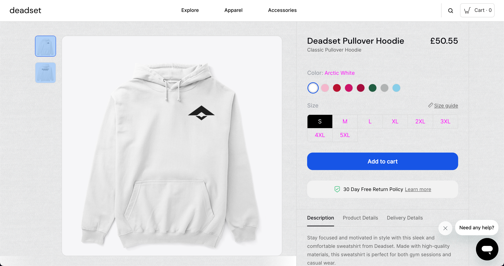

# Chrome-Nostalgia-Mode
Nostalgia Mode - A Chrome extension that transforms any webpage into an early 2000s Geocities-esque design, with a toggle option and website exclusion feature.

# Nostalgia Mode Chrome Extension

Nostalgia Mode is a fun and quirky Chrome extension that takes you on a trip down memory lane by transforming any webpage into an early 2000s Geocities-esque design. With a simple click, you can enable or disable Nostalgia Mode, and even exclude certain websites from being affected by the extension.

## Features

- Instantly apply a nostalgic design to any webpage
- Toggle Nostalgia Mode on and off with a simple click
- Exclude specific websites from being affected by the extension

## Installation

1. Download or clone this repository to your local machine.
2. Open Chrome, navigate to `chrome://extensions`, and enable "Developer mode" in the top-right corner.
3. Click "Load unpacked" and select the Nostalgia Mode extension folder you downloaded or cloned in step 1.
4. The Nostalgia Mode icon should now appear in your Chrome toolbar.

## Usage

To enable or disable Nostalgia Mode, simply click the extension icon in your Chrome toolbar. A popup will appear, allowing you to toggle the mode on and off.

To exclude specific websites from being affected by Nostalgia Mode, type the website URLs (separated by commas) into the input field in the extension popup.

## Contributing

Pull requests and suggestions are welcome. For major changes, please open an issue first to discuss what you would like to change.

## License

[MIT](LICENSE)
